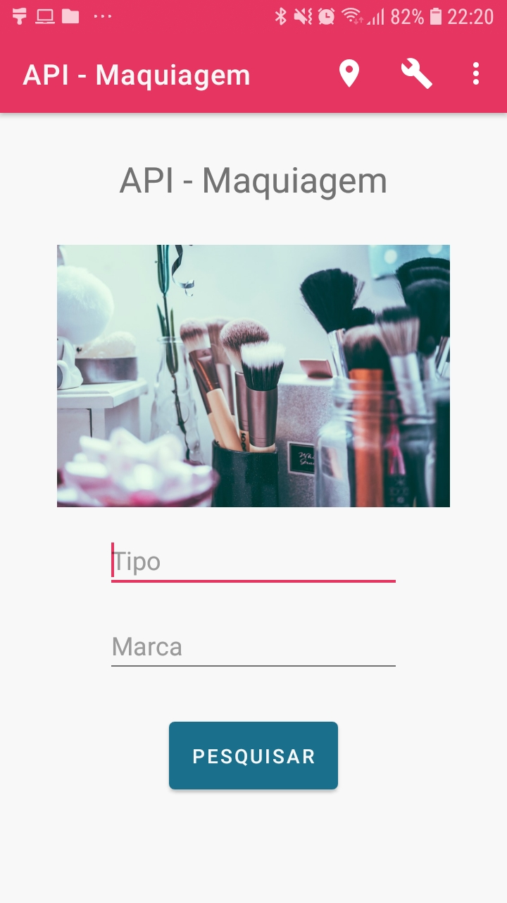
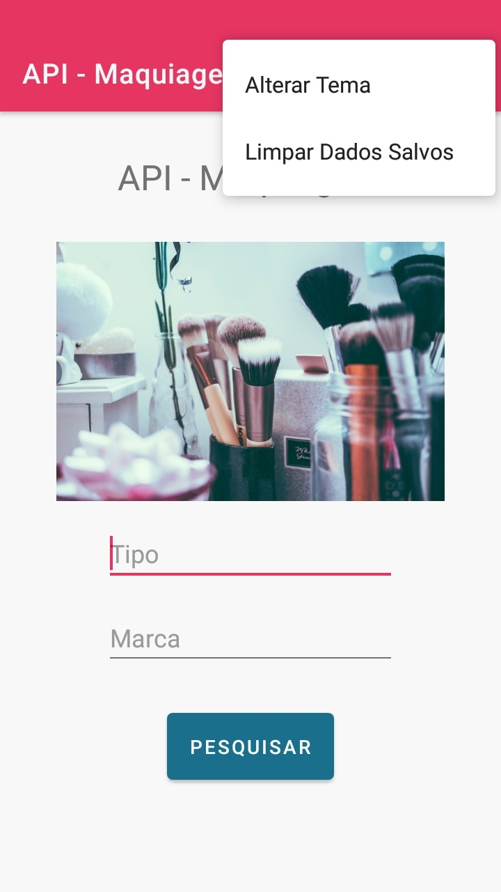
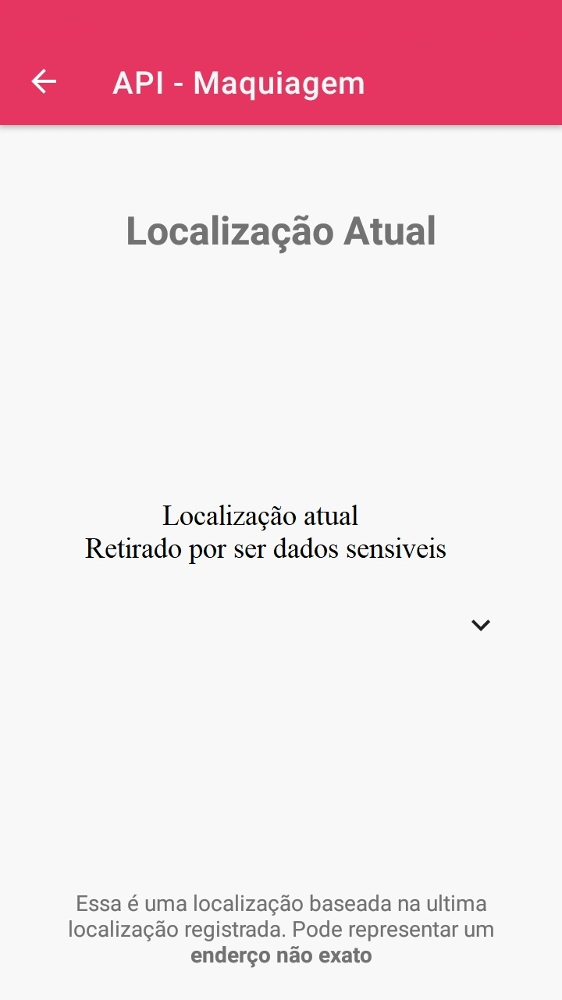
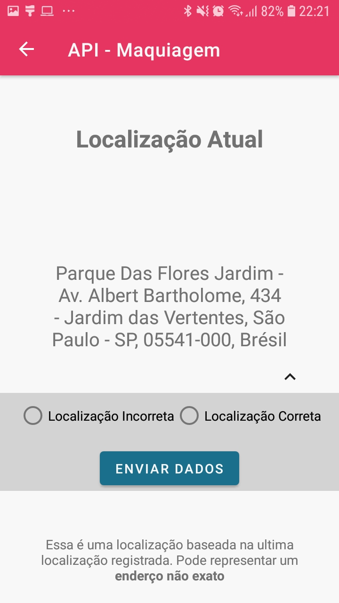
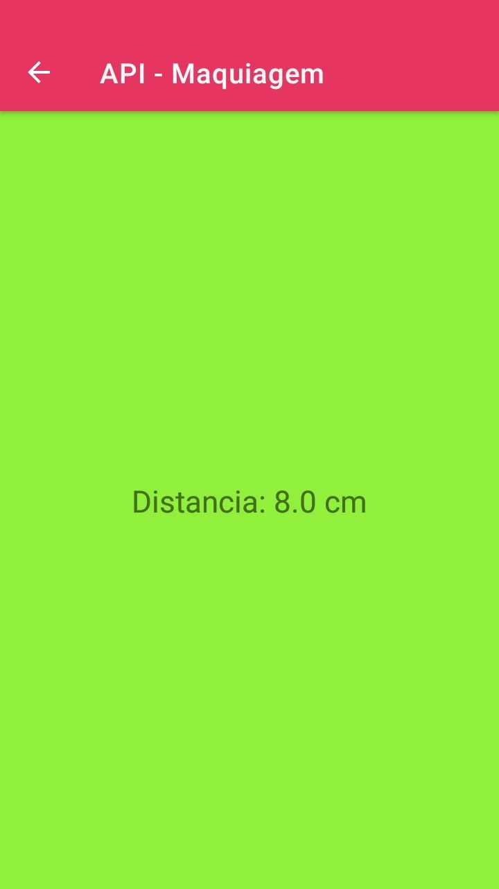
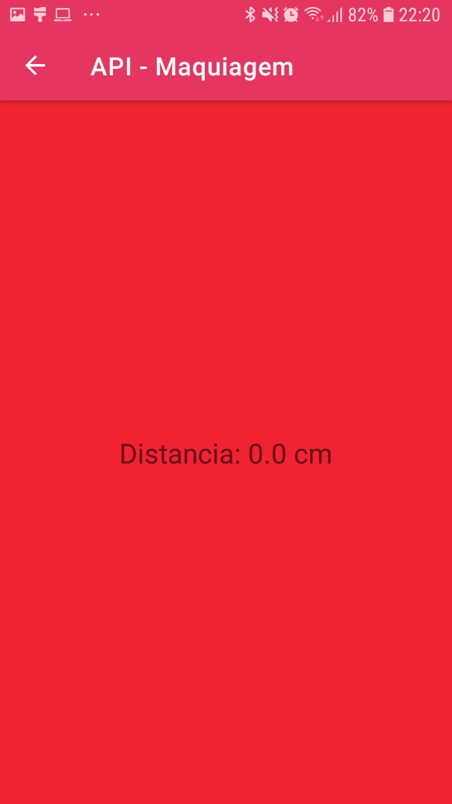

<div align="center">

   <h1 id="title">💄 Makeup Gallery</h1>

<h3>Galeria das Maquiagens da <a href="http://makeup-api.herokuapp.com" tagert="_blank">API - Makeup</a></h3>
<a href="#icons">

</a>

   <a href="https://github.com/GuilhermePalma/Makeup">
      
   </a>

   <a href="https://github.com/GuilhermePalma/Makeup/commits/main">
      
   </a>

   <a href="LICENSE">
      
   </a>

   <br/>
   <br/>
   
<h4>🚧  Em Desenvolvimento 🚀 🚧</h4>

<h5>As Imagens abaixo não estão atualizadas com o Layout atual do APP. Aguarde...</h5>

   <p>
      
      
      
      
      
      
      
      
   </p>

</div>

# Tabela de conteúdos
- [Sobre o projeto](#-sobre-o-projeto)
  - [Funcionalidades](#funcionalidades)
  - [Layout do APP](#-layout-do-app)
  - [Como executar o projeto](#-como-executar-o-projeto)
    - [Pré-requisitos](#pré-requisitos)
    - [Baixando o Projeto](#-baixando-o-projeto)
    - [Instalando o APP](#instalando-o-app)
  - [Tecnologias e Informações](#-tecnologias-e-informações)
    - [Estrutura do Projeto](#estrutura-do-projeto)
    - [Explicação do APP](#explicação-do-app)
    - [Aprendizado Desenvolvido](#aprendizado-desenvolvido)
  - [Contribuidores desse Projeto](#-contribuidores)
  - [Como Contribuir no Projeto ?](#-como-contribuir-no-projeto)


# 💻 Sobre o projeto

💄 **Makeup Gallery** - APP desenvolvido para exibir 900+ Produtos de Maquiagens.

:books: Esse aplicativo busca dados em uma API Externa de Maquiagem, listando as caracteristicas, preço, avaliação e outros atributos de cada Produto. Há tambem uma integração com uma API Interna para que o usuario consiga criar uma conta e deixar salvo seus dados, como produtos favoritos, localizações e outros.

Para que o Projeto existisse, foi necessario um banco de maquiagens para obter suas caracteristicas e informações. Com isso, foi utilizado a API Makeup. Para ver sua documentação, acesse [API Makeup](http://makeup-api.herokuapp.com/)


---

## Funcionalidades

- [x] Para realizar pesquisas de Maquiagens, os filtros disponiveis são:
  - [x] Marca
  - [x] Tags
  - [x] Tipo
- [x] A Aplicação exibe os seguintes dados das Maquigens:
  - [x] Nome
  - [X] Imagem
  - [x] Preço
  - [x] Marca
  - [x] Tipo do Prouto
  - [x] Descrição
  - [x] Avaliação do Produto
  - [X] Tags do Produto
  - [x] Cores disponiveis
- [x] Outros Recuros disponiveis:
  - [X] Obtenção da Localização
  - [x] Tema Escuro

---

## 🎨 Layout do APP

**Imagens** das Telas do APP - [Tema Normal](markdown/imagesNormalMode.md) e [Tema Escuro](markdown/imagesDarkMode.md)

**Video** Mostrando o Funcionamento do APP - [API - Makeup (Youtube)](https://youtu.be/WB9kvWjh3_g)

---

## 🚀 Como executar o projeto

### Pré-requisitos

Antes de começar, você vai precisar ter instalado em sua máquina:
- [Git](https://git-scm.com) → Atualizações e Versionamento no Codigo
- [Android Studio](https://developer.android.com/studio/) → IDE voltada ao Desenvolvimento Android


### 📥 Baixando o Projeto

Execute os Comandos abaixo no **[Git Bash](https://git-scm.com)**, dentro da sua pasta escolhida. Dessa Forma, é possivel acessar o Projeto e seus Diretorios com mais Facilidade :smile:

```bash

# Clone este repositório
git clone https://github.com/GuilhermePalma/Makeup.git

# Acesse a Pasta do Projeto
cd Makeup

# Abra o Android Studio nessa Pasta

```

### Instalando o APP

Caso deseje apenas Instalar o APP para poder interagir com ele, acesse a aba [Releases](https://github.com/GuilhermePalma/Makeup/releases).

Após acessar, Selecione a Versão mais Recente. Deslize a tela até a parte inferior e baixe o arquivo anexado como `app-release.apk` ou `app-release.aab`.

Pegue seu Dispositivo Mobile, abra o aplicativo `Configurações`, selecione o Item `Segurnaça` e ative o Item `Permitir Fontes Desconhecidas`

Com um Cabo USB, conecte seu dispositivo mobile e mova o arquivo **`app-release.apk`** para alguma pasta do Dispositivo. Em seu aparelho, utilize algum aplicativo para acessar as pastas (como por exemplo, o app `Meus Arquivos`), navegue até o local onde o arquivo **`app-release.apk`** se encontrea e clique nele para iniciar a **Instalação** no Aparelho.

Durante a Instalação, seu dispositivo pode exibir alguns avisos informando que o APP vem de um **Fonte Desconhecida e fora da PlayStore**. Entretanto, o APP não apresenta nenhum risco ao seu dispositivo, por isso clique em "Instalar" ou "Continuar mesmo assim" ou "Confiar nesse Aplicativo"

> Após a Instalação do APP, é recomendado que desabilite a opção `"Confiar em Fontes Desconecidas"` (3° Paragrafo)

---

## 🛠 Tecnologias e Informações

As seguintes ferramentas foram usadas na construção do projeto:

- **[Java](https://developer.android.com/docs)** → Linguagem Nativa de Desnvolvimento Android
- **[Postman](https://web.postman.co/)** e **[Swagger](https://editor.swagger.io/)** → Testes da API Externa e Interna
- **[Winsical](https://whimsical.com/)** → Utilizado na Prototipação e Planejamento Inicial
- **[Freepik](https://www.freepik.com), [FlatIcon](https://www.flaticon.com/br) e [Pexels](https://www.pexels.com)** → Icones e Imagens Utilizadas

Além dessas fontes, também foi utilizado Artigos, Videos e Documentação para a Construção desse APP. [Clique Aqui](markdown/references.md) para acessar as demais Referencias do Projeto

### Estrutura do Projeto

Este projeto é divido nas seguintes partes:

1. [Layout Desenvolvidos (XML)](app/src/main/res/layout/)
2. [Configurações das Telas (Activities, Fragments e Widgets Personalizados)](Makeup/src/main/java/com/example/maquiagem/view)
3. [Classe das Entidades do Sistema](Makeup/src/main/java/com/example/maquiagem/model/entity)
4. [Classes de Controladores de Funções do Sistema](Makeup/src/main/java/com/example/maquiagem/troller)

> É possivel encontrar outros arquivos "Fora" dessa organização. As partes descritas acima são apenas generealização da organização do Projeto


### Explicação do APP
**🚧 Em Desenvolvimento 🚧**

### Aprendizado Desenvolvido
- [X] Divisão da Responsabilidade dos Itens do Projeto, seguindo o conceito da POO (Programação Orientada a Objetos)
- [X] **Requisições HTTP** e Utilização de **API**
    - [X] Utilização do HTTP Method: `GET`
    - [X] Formação da URL de Busca pela Classe `URI`
    - [X] Verificação do `Status Code` do resultado da Requisição
- [X] Centralização da **Serialização** de Dados e **JSON**
    - [X] Serialização Dinamica, diferenciando a extração dos Dados conforme o Formato do Item (JSON Object, JSON Array, String, int, boolean)
    - [X] Verificação de Itens Nulos
    - [X] Utilização de **`Cast`** e **`instance of`** ao Obter os Itens
    - [X] **Normalização de Caracteres HTML** para serem exibidos no Layout
- [X] Chamadas Assincronas
  - [X] Utilização do `ExecutorService`, `Callable` e `Future` para a criação e execução de uma nova `Thread` em `Background`
  - [X] Exibição dos Resultados no Layout por meio do `runUiThread`
  - [X] Utilização do `Handler` para animações e ações que demandam um tempo determinado
  - [X] Manipulação de Variaveis
- [X] Utilização dos Ciclos de Integração CI/CD
  - [X] Execução dos Testes nos ultimos commits
  - [X] Geração automatica do Arquivo `.ABB` e `.APK`
- [X] Utilização das **SharedPreferences**
  - [X] Utilização de uma classe que centraliza e controla as SharedPreferences. Dessa forma, evita erro no nome do arquivo e `keys`
- [X] Organização dos arquivos em diretorios que fizessem sentido
- [X] Armazenamento de Dados Localmente (SQLite)
  - [X] Centralização das chamadas do Banco de Dados em um arquivo
- [X] Uso de Widgets do Material Design (Google) e de Bibliotecas Externas (Picasso)
- [X] Divisão das Alterações em Branch
- [X] Desenvolvimento de Widgets para a Tela Inicial do Dispositivo Mobile

---

## 👨‍💻 Contribuidores

💜 Desenvolvedores que participaram desse Projeto :)

<table>
  <tr>
    <td align="center"><a href="https://github.com/GuilhermeCallegari"><br /><sub><b>Guilherme Callegari</b></sub></a><br /><a href="https://github.com/GuilhermeCallegari" title="GitHub">Auxilio na Construção</a></td>
    <td align="center"><a href="https://github.com/guilhermepalma"><br /><sub><b>Guilherme Palma</b></sub></a><br /><a href="https://github.com/guilhermepalma" title="Github">Desenvolvedor Mobile</a></td>
  </tr>
</table>


## 💪 Como contribuir no projeto

[Clique Aqui](markdown/contribution.md) e veja como Contribuir nesse Projeto

---
